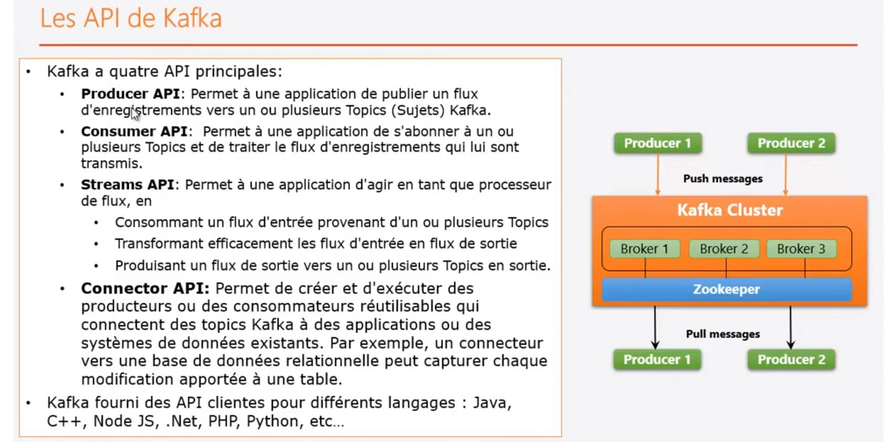
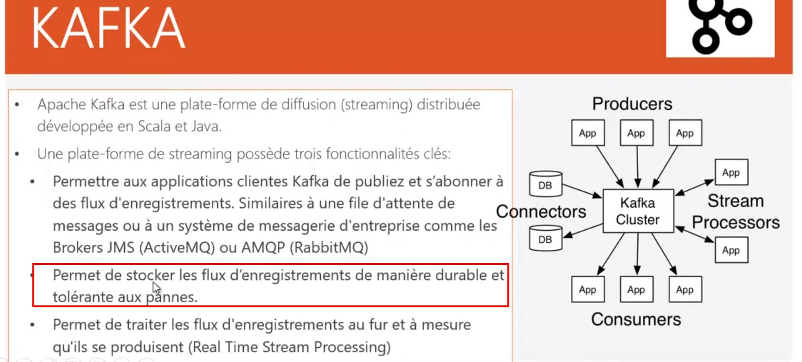
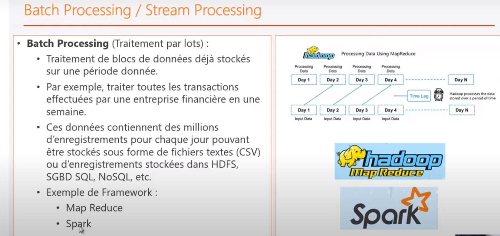
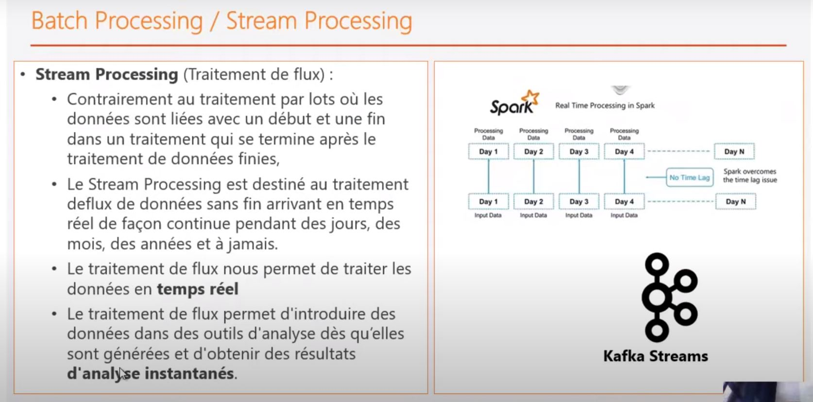
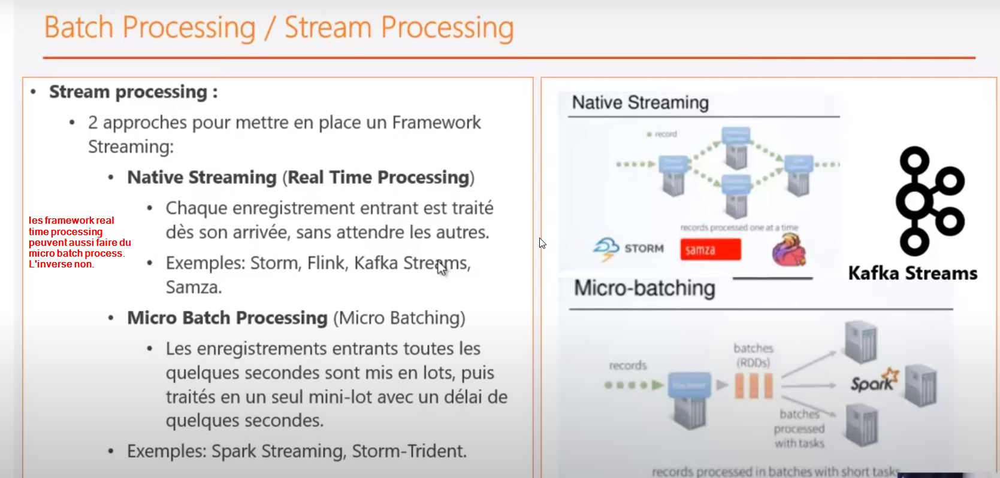
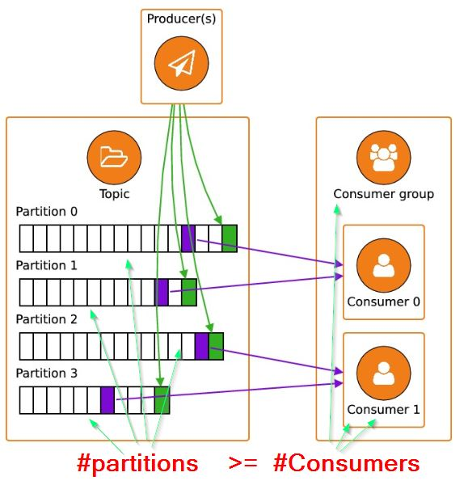
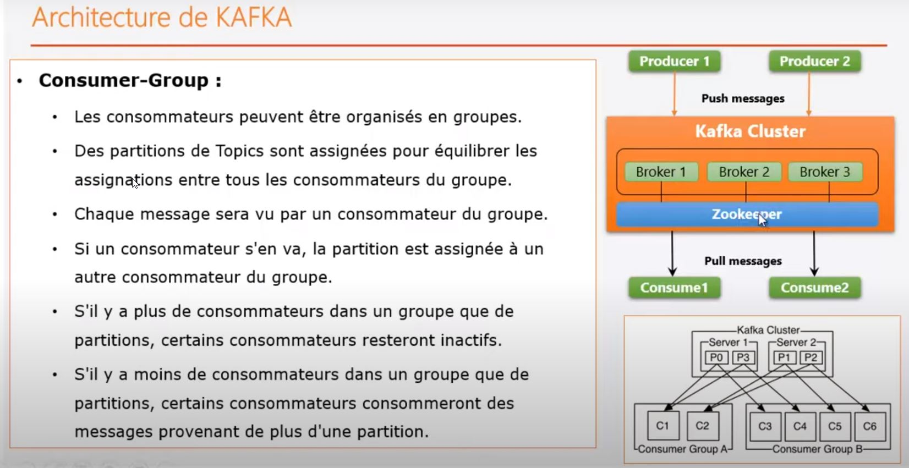

#  kafka






Attention il existe de type de traitmeent le traitment dit batch processing et le stream processing.

**Batch processing** traite les données à intervale plus au moins longue suivant un periodicité.
**Stream processing** traite la données dès qu'elle arrive.
il existe une variate de Stream processing que l'on appelle **micro batch processing** qui se charge de traité les donées plus à fréquence très courtes de lors de la seconde.








En cas de probleme de version java rencontré prévoir de modifier le fichier de configuration d'eclipse **.setting/org.eclipse.jdt.core.prefs** pour prendre en compte la version de java 1.8
````shell script
./..
org.eclipse.jdt.core.compiler.codegen.targetPlatform=1.8
org.eclipse.jdt.core.compiler.compliance=1.8
org.eclipse.jdt.core.compiler.source=1.8
../..
````

# lancement de kafka

Lancer une instance de zookeper et une instance de kafka
- lancement de **zookerper**
````shell script
C:\kafka_2.12-2.5.0>.\bin\windows\zookeeper-server-start.bat .\config\zookeeper.properties
````

- lancement de **kafka**
````shell script
C:\kafka_2.12-2.5.0>.\bin\windows\kafka-server-start.bat .\config\server.properties
````   


## creation d'un topic.

Il faut au moins autant de **partition** qu'il n'y de **consumer**
λ .\bin\windows\kafka-topics.bat  --zookeeper  localhost:2181 --create --replication-factor 1 --partitions 2 --topic test3
Created topic test3.


## lancer un producer 
````shell script
C:\kafka_2.12-2.5.0
λ .\bin\windows\kafka-console-producer.bat   --broker-list localhost:9092 --topic test3

````


## lancer un consumer
````shell script
C:\kafka_2.12-2.5.0
λ .\bin\windows\kafka-console-consumer.bat   --broker-list localhost:9092 --topic test3
````


## gestion des topics

on peut afficher les topics au travers de zookeeper ou directment depuis un broker.

````shell script
C:\kafka_2.12-2.5.0                                                                     
λ .\bin\windows\kafka-topics.bat  --zookeeper  localhost:2181 --list                    
__consumer_offsets                                                                      
test1 
```` 

                                                                      
````shell script
C:\kafka_2.12-2.5.0                                                                     
λ .\bin\windows\kafka-topics.bat  --bootstrap-server  localhost:9092 --list             
__consumer_offsets    
````                                                                                
                                                                  

## Les groups
Au sein d'un group les données en prevenance d'un topic sont lus altenativements par le consumer1, consumer2 ..consumerN. Les lectures sont faites en RoundRobin. Si l'on souhaite que tous les consommateurs reussissent à lire des messages il faut veiller à avoir autant de partitions pour un topic donné que de consummers.



